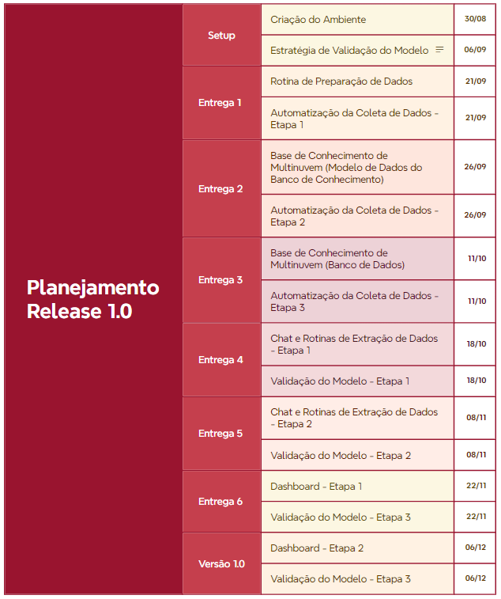

# CloudGPT

## Introducao

Com o advento da portaria SGD/MGI 5.950 responsavel pela definicao de nuvem de governo, surge a corrida para preparacao da infraestrutura necessaria para o fornecimento desse servico. As estatais de tecnologia do governo federal (Dataprev e Serpro) despontam como responsaveis pela realizacao deste investimento, que inclui realizacao de parceria tecnológica com os principais fornecedores de solucao de computacao em nuvem do mundo (ex.: AWS, Google, Oracle, Huawei, ....). 

A estratégia adotada pelas estatais passa pela composicao de uma multinuvem, pois dependem da tecnologia dos principais fornecedores de nuvem para composicao dos seus portfólios. Espera-se com a evolucao do portfólio que as estatais expandam as suas "caixas de ferramentas", fornecendo para o governo federal a pavimentacao tecnológica necessaria para enderecar seus objetivos estratégicos. 

## Desafios

Trazer para o ambiente interno das estatais a tecnologia desses fornecedores requer, além do investimento financeiro, a preparacao do corpo funcional das empresas para tratar dessa nova infraestrutura tecnológica. A implantacao de uma nuvem _on premises_ traz nao somente a solucao de computacao e os equipamentos, mas toda uma _stack_ tecnológica que, de forma coesa, representa uma nova abordagem de promover o _delivery_ de produtos. Quando comparado ao ambiente tradicional de datacenter, e de forma mais abrangente, ao ambiente tradicional de _delivery_ de uma estatal de tecnologia, faz-se necessario que os atuais times responsaveis pelo suporte, desenho arquitetural, implantacao, gestao do ciclo-de-vida, desenvolvimento, negócio, enfim, toda cadeia produtiva da empresa reflita sobre a forma como ira se adaptar à nova realidade tecnológica. Paradigmas de automacao foram vencidos em escala global e repensa-los no contexto local passa muito mais por uma fase de adaptacao e reflexao dos atuais processos do que de customizacao da tecnologia à realidade de cada empresa. De fato, repensar tecnologicamente cada solucao à realidade da empresa estatal parece ser a fórmula para recebermos o _castigo de sísifo_, pois observaremos a tecnologia evoluir e o lancamento de novos produtos numa escala muito maior do que conseguiremos adapta-los a nossa realidade. 

Com foco no problema da percepcao real da mudanca promovida pela multinuvem do ponto de vista do corpo funcional, é necessario que a visibilidade sobre a oferta de servicos seja percebida pelas diversas areas, e que os desafios de negócio sejam mapeados com suas potenciais tecnologias, de forma a percerbermos quanto e quais tecnologias candidatas possuem potencial de compor novos produtos. Ainda, as informacões sobre capacidades, sobre formato da entrega de servicos, sobre especialistas, oportunidades e todo o contexto envolvido com a utilizacao de produtos do portfólio multinuvem deve ser amplamente divulgado para que as áreas responsáveis pelo _delivery_ consigam adequar seus processos à essa nova realidade.

## Solucao

A composicao de uma IA Generativa no formato de chat, consolidando o conhecimento sobre (a) o objetivo de cada produto, permitindo que cada usuario intereja com a ferramenta tirando duvidas sobre os produtos e (b) o conhecimento de cada empresa sobre o produto, consolidando informacões sobre oportunidades, capacidade, ofertas, questões contratuais, enfim, toda sorte de informacões para que gestores, analistas, arquitetos, comercial e demais envolvidos possam ter uma visao consolidada sobre o panorama da multinuvem em suas empresas.

CloudGPT é uma plataforma de inteligência artificial para apoiar a governança corporativa, colaborando com a curadoria de conhecimento técnico e de negócio de multinuvem

Objetivo Geral: Construção de Software baseado em plataforma de Inteligência Artificial, em ambiente seguro, com capacidade para realizar atividades relacionadas à ingestão, avaliação, organização, classificação, consolidação e composição de normativos, documentação técnica e de negócio, incluindo as de acesso restrito, através de uma interface com uso de linguagem natural e com capacidade de lidar com as especificidades da Empresa para imersão no contexto da Multinuvem de Governo. 

Objetivos Específicos:
1)	Composição de software capaz de utilizar capacidades de inteligência artificial, tais como interpretação de texto em linguagem natural, entendimento sobre o contexto da Multinuvem e composição de base de conhecimento com os relacionamentos entre os artefatos de forma coesa
2)	Estruturação de processo de preparação das fontes de dados, adequando a documentação de governança (normativos/instruções técnicas/documentação de qq natureza) no formato adequado para tratamento
3)	Viabilizar a ingestão dos dados através do tratamento fontes de dados em formato de arquivo com capacidade de integrar em um ecossistema único toda a base de informações 
4)	Alcançar a capacidade de organizar conteúdo no tempo, garantindo que a ordem de prevalência temporal seja obedecida em tempo de composição da base de informações
5)	Alcançar a capacidade de classificar a informação com base no conteúdo de maior afinidade, obedecendo a categorização de temas e suas relações hierárquicas
6)	Realizar a avaliação do conteúdo consolidado, aplicando a contextualização e composição textual da análise referente ao questionamento realizado pelo usuário
7)	Inserir a solução em um ambiente seguro, formado por infraestrutura computacional controlado pela Empresa, controlando o acesso de usuário e garantindo a segurança 

### Visão Macro

### Modelo

No intuito de dar encaminhamento à modelagem da solução, é necessário a composição/seleção de modelos adequados ao tratamento das informações específicas sobre o contexto multinuvem. A imagem a seguir consolida um fluxo geral de composição de modelos e seus principais frameworks

## Planejamento

No intuito de dar visibilidade ao andamento das atividades, segue proposta de cronograma para evolução da solução

